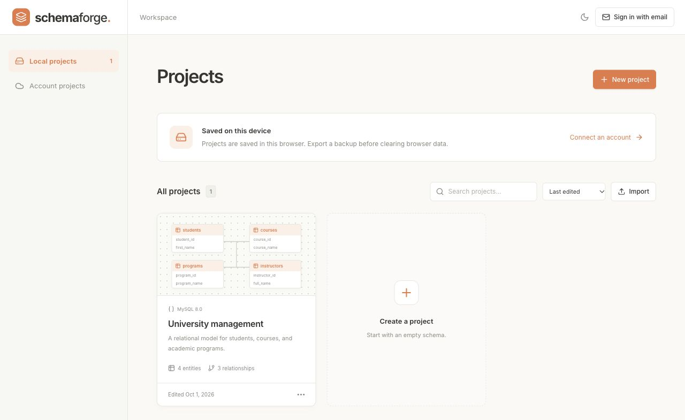
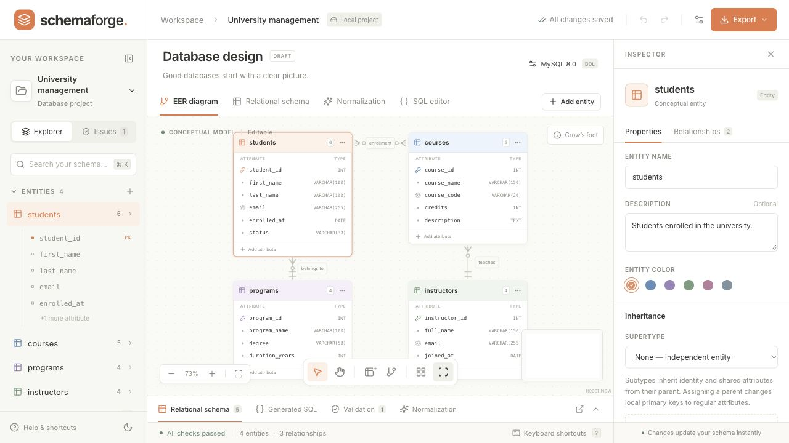
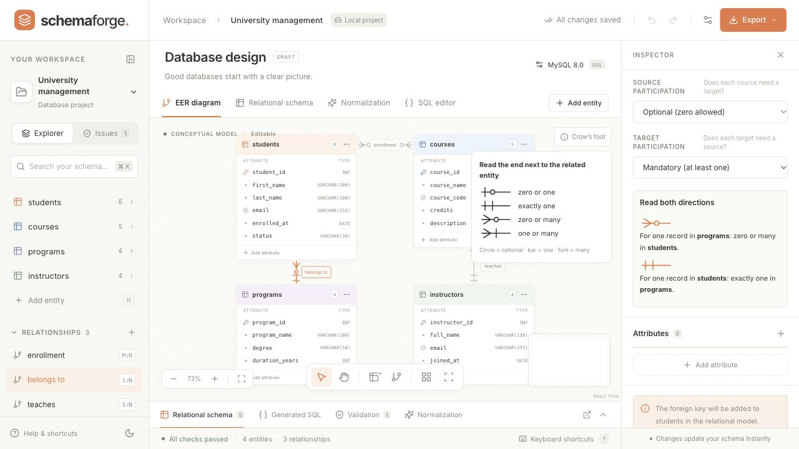
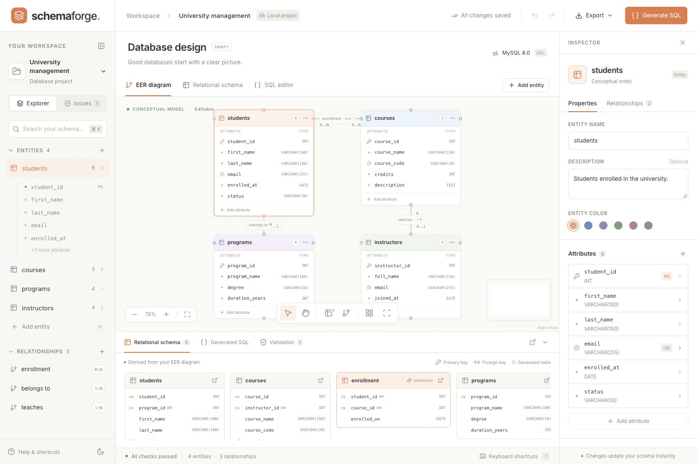
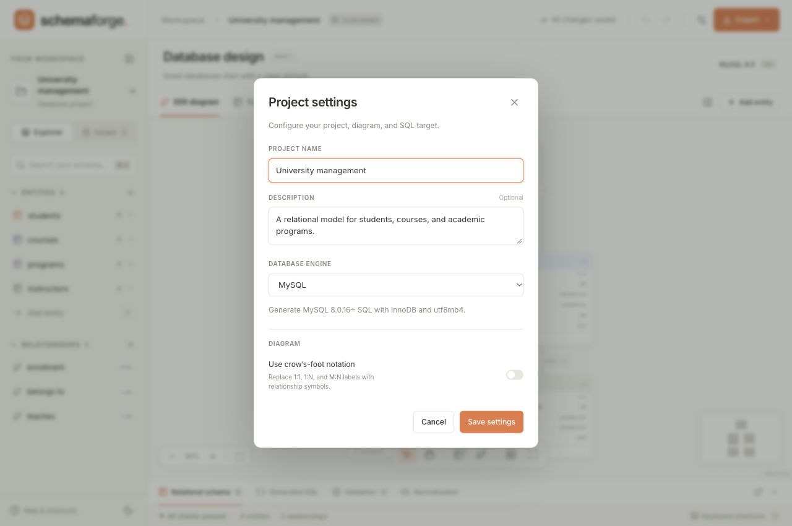
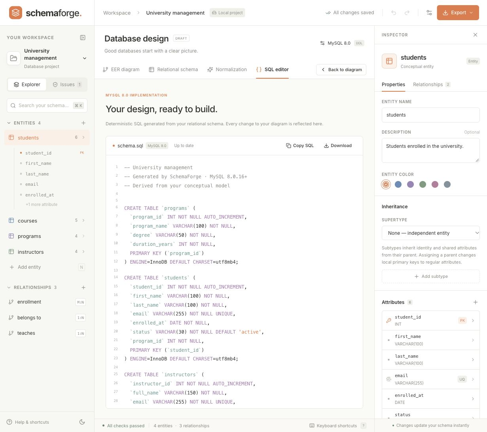
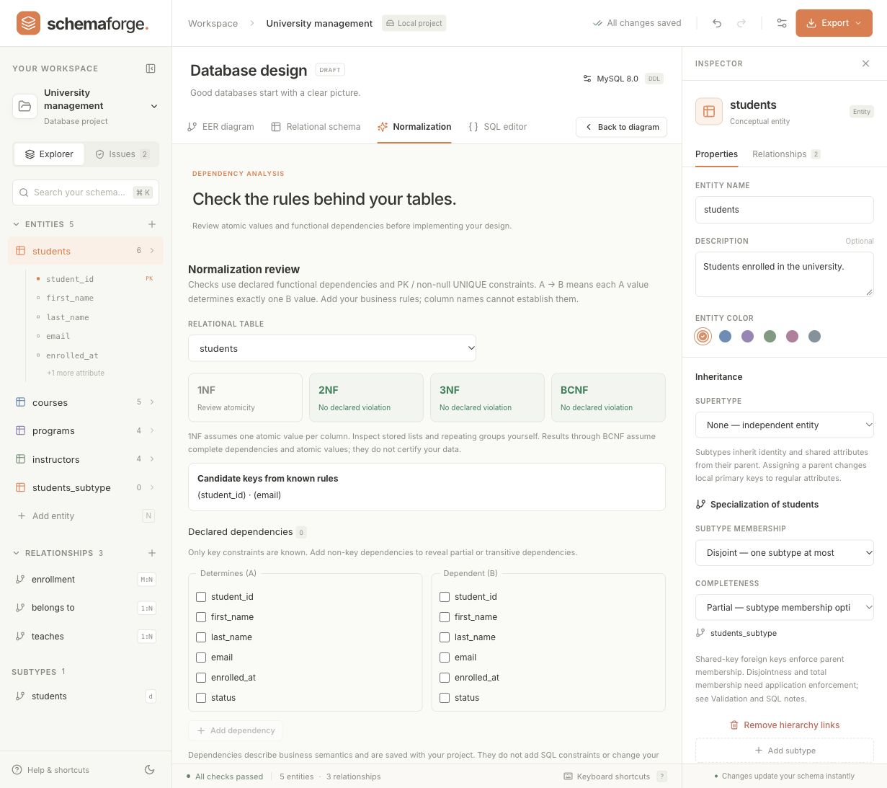

   
  <h1>SchemaForge</h1>

**Design your database visually. See the tables. Export the SQL.**

SchemaForge is a browser-based database design app. Keep multiple projects in a local project library, model entities and relationships, inspect the resulting tables, and export MySQL or PostgreSQL SQL.

No account or backend setup required. Projects save locally in your browser.

[Features](#features) · [Design workflow](#design-workflow) · [Handy shortcuts](#handy-shortcuts) · [Tech stack](#tech-stack)

## Screenshots

### EER diagram

The diagram displays associative tables alongside entities. Numeric cardinality labels are the default; the inspector can be minimized to give the canvas more room.

### Crow’s-foot notation

Enable **Use crow’s-foot notation** in **Project settings** to replace numeric labels with endpoint symbols. This choice saves with the project and does not change the generated tables or SQL.

### Relational schema

### Project settings

Open settings using the button beside **Export**. The database engine shown above the canvas is a status label.

### SQL preview

## Features

| Capability              | What you can do                                                                                                                                                 |
| ----------------------- | --------------------------------------------------------------------------------------------------------------------------------------------------------------- |
| Visual modeling         | Add, arrange, and connect entities on an interactive enhanced entity–relationship (EER) canvas. Edit names, attributes, keys, and constraints in the inspector; minimize and reopen it while keeping your selection. |
| Relationship design     | Model one-to-one, one-to-many, and many-to-many relationships with participation and relationship attributes. Choose numeric labels or crow’s-foot symbols per project. |
| Associative tables      | M:N relationships appear as a table with generated PK/FK columns and two one-to-many connectors. Select the table or a connector to edit the source relationship. Dragged table positions save with the project and support undo/redo. |
| Live relational schema  | See tables, primary keys, foreign keys, and associative tables update as you edit the diagram. Composite keys and multivalued attributes are supported.         |
| Supertypes and subtypes | Build nested inheritance hierarchies and describe disjoint or overlapping membership and total or partial completeness.                                         |
| Normalization review    | Declare functional dependencies, inspect candidate keys, and review potential 2NF, 3NF, and BCNF violations.                                                    |
| SQL generation          | Preview and export DDL for MySQL or PostgreSQL. Choose **No engine** to focus on conceptual and relational design.                                              |
| Design validation       | Find modeling errors, engine-specific issues, and constraints that need application-level enforcement before exporting SQL.                                     |
| Local projects          | Autosave in your browser and export or import portable `.schemaforge.json` backups.                                                                             |
| Everyday editing        | Search entities and attributes, undo and redo changes, duplicate entities, scroll view tabs when space is limited, and switch between light and dark themes. |

### Understand the rules behind your tables

Use the normalization workspace to record business dependencies and inspect the resulting candidate keys and normal-form findings. Subtypes share their parent's key while keeping their own attributes in separate tables.

## Design workflow

1. **Start a project.** The home page lists your projects. Open the included university sample, import a JSON backup, or create a blank project. Click **Workspace** in the editor to return home.
2. **Build the model.** Add entities, edit their attributes, and drag a connection handle between entities. Select a relationship to set its cardinality and participation. An M:N relationship appears as an associative table connected to both participants by 1:N relationships.
3. **Adjust the view.** Use the settings button beside **Export** to choose the SQL target and relationship notation. Numeric labels are the default; enable **Use crow’s-foot notation** for symbols. Minimize the inspector from its header or the canvas toolbar, then use **Show inspector** to reopen it.
4. **Explore the tables.** Switch to **Relational schema** to inspect generated tables and keys. Associative tables update from their source relationships; they are not additional entities you need to create manually.
5. **Review the design.** Check validation findings and declare functional dependencies in **Normalization**.
6. **Export your work.** Choose an engine in **Project settings**, resolve validation errors, and use **Export** to download SQL or a JSON project backup.

## Handy shortcuts

| Action                      | Shortcut                                |
| --------------------------- | --------------------------------------- |
| Add an entity               | `N` or double-click the canvas          |
| Search the schema           | `Cmd/Ctrl + K`                          |
| Undo / redo                 | `Cmd/Ctrl + Z` / `Cmd/Ctrl + Shift + Z` |
| Duplicate selected entities | `Cmd/Ctrl + D`                          |
| Save locally                | `Cmd/Ctrl + S`                          |
| Delete selection            | `Delete` / `Backspace` outside inputs   |
| View all shortcuts          | `?`                                     |

## Project storage and design scope

- **Local workspace:** Each project saves independently in this browser on this device. Existing single-project data migrates into the library automatically. Export JSON backups to move projects or protect them from cleared browser data.
- **Account workspace:** Optional email sign-in stores projects under your account. Local projects remain separate; export/import JSON to copy one into your account workspace. Failed uploads retain a device cache and can be retried. Concurrent edits to the same project use the last upload; live collaboration and conflict merging are not included.
- **SQL output:** SchemaForge generates DDL; it does not connect to a database, execute SQL, or migrate existing data. MySQL output targets 8.0.16 or later; PostgreSQL output targets 10 or later. SQL export requires a selected engine and no validation errors.
- **Normalization:** Findings depend on the business dependencies you declare and assume atomic values. Review 1NF manually. Large candidate-key searches may leave 2NF/3NF unresolved. Suggested decompositions are advisory.
- **Validation suggestions:** Some findings explain transformations already applied to the generated schema; others recommend design changes. Selecting a finding selects the related item for review in the inspector. Suggestions do not have a one-click acceptance action.
- **Modeling:** Composite keys are supported; composite attributes are not. Some participation and subtype membership rules require application or transactional trigger enforcement, which validation identifies.

## Optional email sign-in and cloud projects

When email sign-in is available, choose **Sign in with email** and open the link sent to your inbox. Your account workspace loads after sign-in. Use **Local projects** to access the device workspace at any time. If email features show **Coming soon**, you can continue using local projects.

## Tech stack

| Area | Technologies |
| ---- | ------------ |
| Interface | React, TypeScript |
| Build tooling | Vite |
| Styling and UI | Tailwind CSS, Radix UI, Lucide |
| Diagram canvas | XYFlow (React Flow) |
| State management | Zustand |
| Optional cloud storage and authentication | Supabase |

## Modeling reference

Crow’s foot minimum/maximum symbols, directional readings, association-key refinement for repeated pairs, and conceptual `{Multivalued}` / `[Derived]` labels follow the supplied _ERD and Relational Database Master Study Guide_, particularly sections 12–18, 43, and 54–55. Its remaining topics do not imply every feature is implemented; composite attributes, explicit weak-entity ownership, ternary relationships, and configurable referential actions remain future work.
